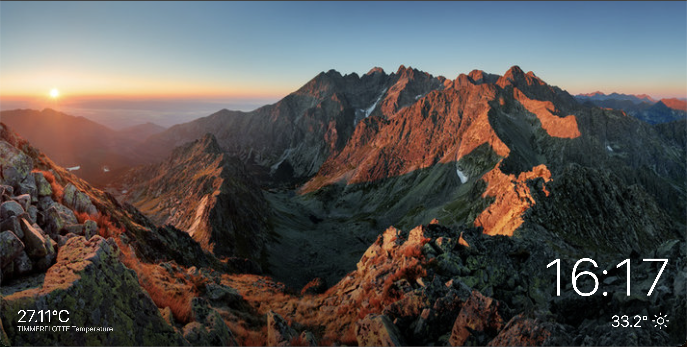
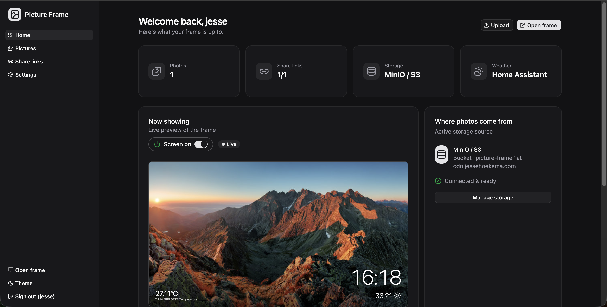

# Picture Frame




A self-hosted digital picture frame with a full admin dashboard. Point a screen
(a Raspberry Pi, a tablet, an old monitor) at the frame URL and it plays a
synchronized slideshow with a clock, weather and live sensor readouts from home assistant. Manage
everything — photos, share links, storage, automations — from a clean dashboard.

Built with SvelteKit (Svelte 5), Tailwind CSS v4, shadcn-svelte, and SQLite.

---

## Features

**The frame**

- Full-screen slideshow with a large clock, weather overlay and sensor reading from hass.
- **Time-synchronized** — every display shows the same photo at the same moment,
  so multiple screens stay in lock-step no matter when they were opened.
- Fade or instant transitions, cover/contain fit, optional shuffle,
  configurable seconds-per-picture.
- Weather from **Home Assistant** or **OpenWeatherMap** (°C/°F).
- Show live **Home Assistant sensors** (temperature, humidity, …) in the corner.
- **Instant updates** over Server-Sent Events — toggles and setting changes reach
  the frame in ~150 ms without a reload.

**Photos & sharing**

- Upload from the dashboard; drag to reorder; delete.
- **Share links** — create as many as you like, each with an optional password,
  so family and friends can add photos without an account.
- Pluggable **storage backends** (each keeps its own library):
  - **On this server** — local disk, zero config.
  - **MinIO / S3** — object storage (auto-detects http/https).
  - **Immich** — display an album from your Immich server; uploads are pushed
    into it.
- Two-tier **media cache** (in-memory + disk) so remote images render fast.

**Automations (Home Assistant)**

- Turn the display **off when there's no motion**, back on when motion returns
  (configurable timeout).
- Or make the screen **follow a light/switch** — light on = screen on.
- Optionally drive a physical **display power entity** (switch/light/media_player).
- Manual **screen on/off** toggle on the dashboard (instant).

**Dashboard**

- First-run **setup wizard** (create the admin account + choose storage).
- Live **preview** of what the frame is showing right now.
- Overview stats, storage source, and **device stats** (CPU temp, memory, load,
  uptime) when running on a Raspberry Pi.
- Change your username/password, adjust the live refresh interval, dark/light
  theme, animated tabbed settings.

---

## Run it on a Raspberry Pi (recommended)

Turn a Raspberry Pi into a wall-mounted frame. **One command** does everything —
it installs Node.js & Chromium, clones the project, builds it, creates a systemd
service, and configures the desktop to launch the frame full-screen on boot.

On a fresh **Raspberry Pi OS (with desktop)**, open a terminal and run:

```bash
curl -fsSL https://raw.githubusercontent.com/JesseHoekema/picture-frame/main/deploy/raspberry-pi/bootstrap.sh | sudo bash
```

That clones into `~/picture-frame` and runs the full installer. When it finishes,
reboot and the frame opens full-screen:

```bash
sudo reboot
```

_(If your default branch is `master`, change `/main/` to `/master/`.)_

<details>
<summary>Prefer to clone manually?</summary>

```bash
sudo apt-get update && sudo apt-get install -y git
git clone https://github.com/JesseHoekema/picture-frame.git ~/picture-frame
cd ~/picture-frame
bash deploy/raspberry-pi/install.sh
sudo reboot
```

</details>

Then finish first-run setup from any device on your network — the installer
prints the exact URLs, e.g.:

```
http://<pi-hostname>.local:3000/     (or  http://<pi-ip>:3000/ )
```

The installer also creates a `.env` (with the Pi's hostname, LAN IP and localhost
allowed) — see [Configuration](#configuration-env) to tweak upload size, origins
and data locations.

**Updating:** re-run the same one-liner, or from the checkout run
`bash deploy/raspberry-pi/install.sh` — it pulls the latest push and updates in
place.

Kiosk options, systemd details and troubleshooting are in
**[deploy/raspberry-pi/README.md](deploy/raspberry-pi/README.md)**.

---

## Routes

| Path              | What it is                                                      |
| ----------------- | --------------------------------------------------------------- |
| `/frame`          | The picture frame (public). This is what a display should open. |
| `/`               | Redirects to the dashboard, or login, or first-run setup.       |
| `/admin`          | Dashboard (overview, live preview, device stats).               |
| `/admin/pictures` | Manage photos (upload, reorder, delete).                        |
| `/admin/links`    | Create & manage share links.                                    |
| `/admin/settings` | Slideshow, clock & weather, storage, Home Assistant, account.   |
| `/share/<token>`  | Public upload page for a share link (password-gated if set).    |

---

## Quick start (development)

Requirements: **Node.js 22+** and **pnpm** (or npm).

```bash
pnpm install
pnpm dev
```

Open the printed URL (http://localhost:5199). You'll land on the **setup wizard**
the first time — create your admin account and pick a storage backend
(**On this server** needs no configuration). The frame lives at `/frame`.

Useful scripts:

```bash
pnpm dev      # dev server with HMR
pnpm build    # production build (Node server → ./build)
pnpm preview  # preview the production build
pnpm check    # type-check (svelte-check)
```

---

## Configuration (`.env`)

All settings are read from a **`.env`** file in the project root. Copy the
template and edit it:

```bash
cp .env.example .env
```

- **Development** (`pnpm dev`) — `.env` is loaded automatically.
- **Production** (`node build`) — it is **not** auto-loaded; start with
  `node -r dotenv/config build`, or let your process manager load it. The
  Raspberry Pi installer wires it up via a systemd `EnvironmentFile` and even
  creates the `.env` for you.

All values have defaults, so `.env` is optional for a quick local try but
recommended for any real deployment.

> ⚠️ **Set `BODY_SIZE_LIMIT` if you'll upload photos.** In production
> (`node build`) `adapter-node` caps request bodies at **512 KB** by default, so
> a normal phone photo fails with an obscure "network error". Set
> `BODY_SIZE_LIMIT=100M` (or higher) — this applies to **both** dashboard uploads
> and share-link uploads. `pnpm dev` has no limit, and the Raspberry Pi installer
> already sets `100M` for you.

| Variable          | Default                 | Purpose                                                                                                                                        |
| ----------------- | ----------------------- | ---------------------------------------------------------------------------------------------------------------------------------------------- |
| `PORT`            | `3000`                  | Port to listen on.                                                                                                                             |
| `HOST`            | `0.0.0.0`               | Interface to bind.                                                                                                                             |
| `BODY_SIZE_LIMIT` | `512K`                  | **Required for uploads** — set `100M` (or higher) or photo uploads fail.                                                                       |
| `ALLOWED_ORIGINS` | —                       | Extra origins allowed to POST, comma-separated. Same-origin is always allowed, so opening the app by hostname, LAN IP or localhost just works. |
| `DATABASE_PATH`   | `data/picture-frame.db` | SQLite database file.                                                                                                                          |
| `UPLOAD_DIR`      | `data/uploads`          | Local-backend photo storage.                                                                                                                   |
| `MEDIA_CACHE_DIR` | `data/cache`            | Cached renditions of remote images.                                                                                                            |

All persistent state lives under **`data/`** (database, local uploads, cache).
Back up that folder to back up everything.

> **Share links:** for other people to upload through your share links, the URL
> they open must be an allowed origin — same-origin is automatic (any address you
> actually reach the app by works), and you can add more to `ALLOWED_ORIGINS`.
> Combined with `BODY_SIZE_LIMIT` above, these are the two things that make
> share-link uploads work.

---

## Running in production

Build the standalone Node server (`@sveltejs/adapter-node`) and run it, loading
your [`.env`](#configuration-env):

```bash
pnpm build
node -r dotenv/config build   # serves on $PORT (default 3000)
```

---

## Home Assistant setup

1. In Home Assistant, create a **long-lived access token**
   (Profile → Security → Long-lived access tokens).
2. In the dashboard: **Settings → Home Assistant**, paste the base URL and token,
   and **Test & save**.
3. Pick entities from the searchable lists:
   - a **weather** entity (if you use HA for weather),
   - a **motion sensor** and/or a **light** to control the screen,
   - a **display power** entity to switch a physical screen,
   - any **sensors** to show on the frame.

Prefer no Home Assistant? Use **OpenWeatherMap** for weather
(Settings → Clock & weather) with a free API key and a city or `lat,lon`.

---

## Tech stack

- **SvelteKit 2** + **Svelte 5** (runes), `adapter-node`
- **Tailwind CSS v4** + **shadcn-svelte** (bits-ui)
- **better-sqlite3** for storage of users, settings, links and image metadata
- **minio** client for S3-compatible storage; Immich REST API
- Server-Sent Events for live frame updates

## Project structure

```
src/
  routes/
    frame/          the picture frame (/frame)
    admin/          dashboard, pictures, links, settings
    share/[token]/  public upload page
    api/            media, frame stream/live, system stats
  lib/server/       db, auth, settings, storage backends, HA, cache, stats
deploy/raspberry-pi/  one-shot installer, kiosk, systemd unit
data/               SQLite db, local uploads, media cache (gitignored)
```

---

## License

MIT
